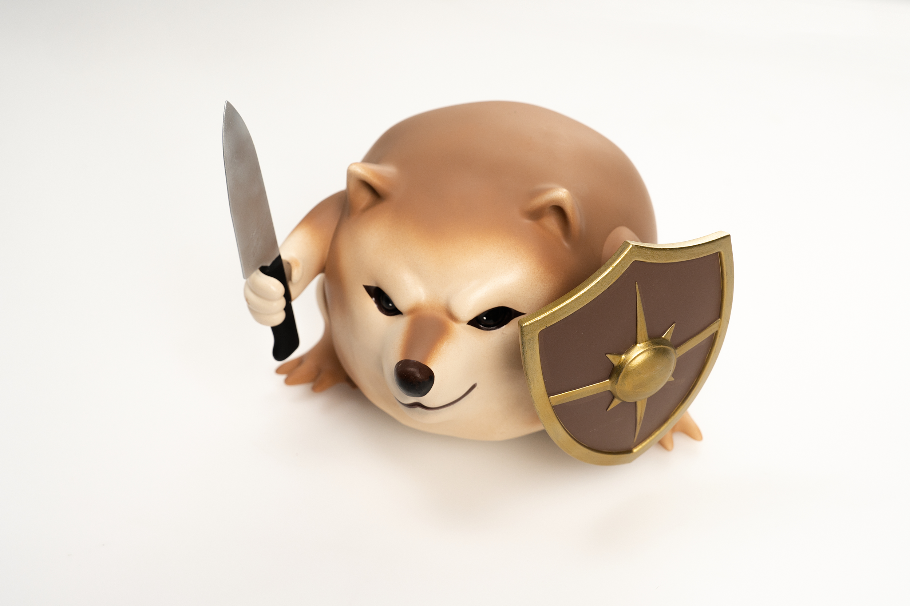
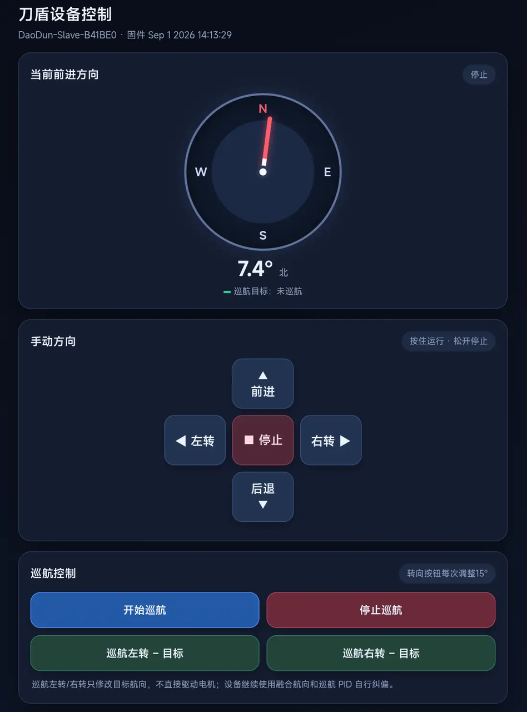
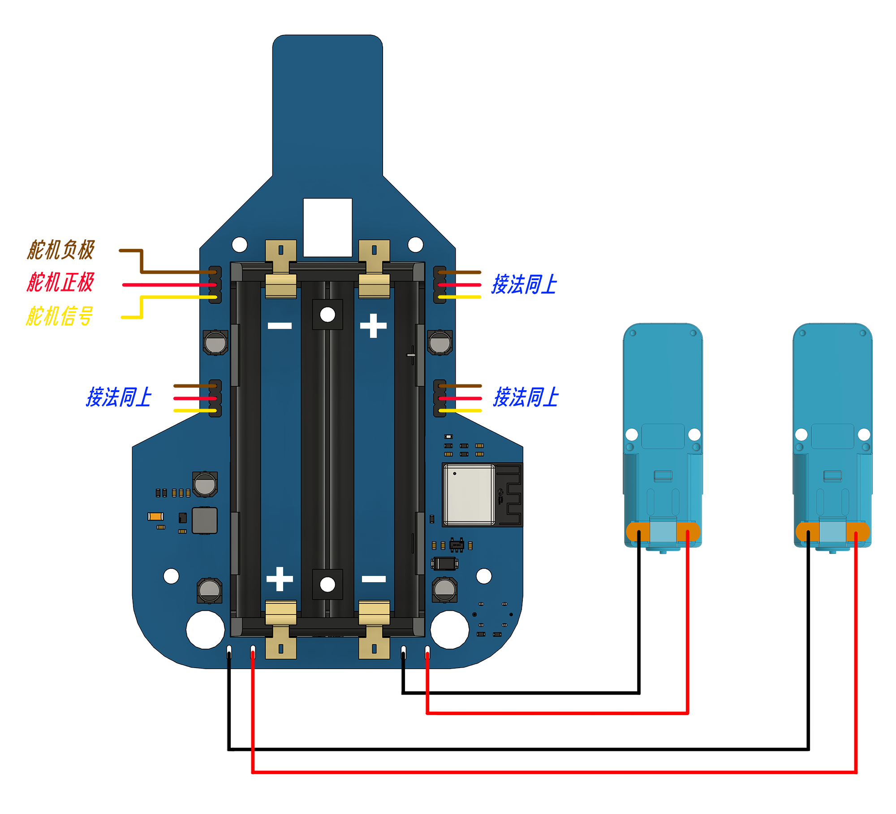
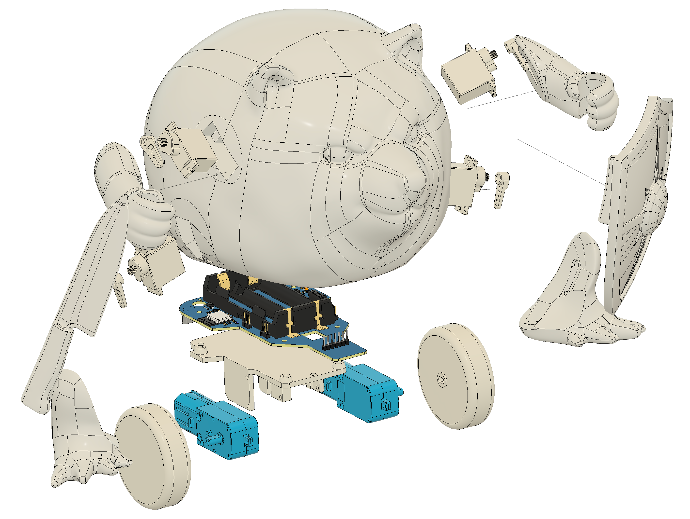

# what the dog doing dog
<p align="center"><em>"What the dog doing?"</em>
<p align="center"><em>"我的刀盾"</em>


<p align="center">


视频参考：[做了100只刀盾狗...](https://www.bilibili.com/video/BV1BJ426FEGE/)

硬件开源：[立创开源平台](https://oshwhub.com/htx-studio/project_bhroxrwz)

[GitHub repository](https://github.com/htx-studio/what-the-dog-doing-dog)

[Gitee repository](https://gitee.com/htxstudio/what-the-dog-doing-dog)

3D 模型：[MakerWorld](https://makerworld.com.cn/zh/models/2922246-htx-dao-dun-gou#profileId-3426149)

使用文档：[使用文档](./docs/刀盾狗使用说明书.pdf)


## 仓库目录结构

#### pio_project

刀盾单机版PlatformIO工程

#### lceda_project

立创EDA工程文件

#### docs

相关器件参考手册和说明文档资料


## 功能介绍


设备上电后会建立一个无密码 AP：

```text
DaoDun-Slave-XXXXXX
```

`XXXXXX` 为设备 STA MAC 地址后六位手机或电脑连接后，在浏览器中打开：

```text
http://192.168.4.1/
```

网页提供以下控制：

* 按住上、下、左、右按钮控制前进、后退、原地左转和原地右转
* 松开方向按钮立即停车
* 通信超过 900 ms 未刷新时自动停车
* 开始或停止巡航
* 巡航状态下每次向左或向右修改 15° 目标航向
* 以指南针显示当前融合航向和巡航目标航向

## 制作指南

### 接线


### 组装


详细组装文档见docs目录下pdf文件[刀盾狗组装说明](./docs/刀盾狗组装说明.pdf)

### 其它物料清单

| 物料 | 用量 | 备注 |
| :--- | :--: | :--- |
| 刀盾控制板 | 1 | 刀盾设备端主控 |
| TT电机 | 2 | 全金属齿，减速比1:90 |
| MG90s 舵机 | 4 | 左脚、右脚、左手、右手 |
| 18650电池| 2 | 需要额外的充电器 |
| 内六角平尾自攻  | 7 | M2.6x12|
| 内六角杯头  | 2 | M2.5x12|
| 内六角平尾自攻  | 4 | M2.3x10|
|迷你万向轮|1||
| 外壳及机械结构件 | 1  | 参照 3D 模型 |


---

如果项目还有不足，欢迎提交问题和改进建议，感谢支持

## 引用

SensorLib：[GitHub repository](https://github.com/lewisxhe/SensorLib)

Adafruit AHRS：[GitHub repository](https://github.com/adafruit/Adafruit_AHRS)
